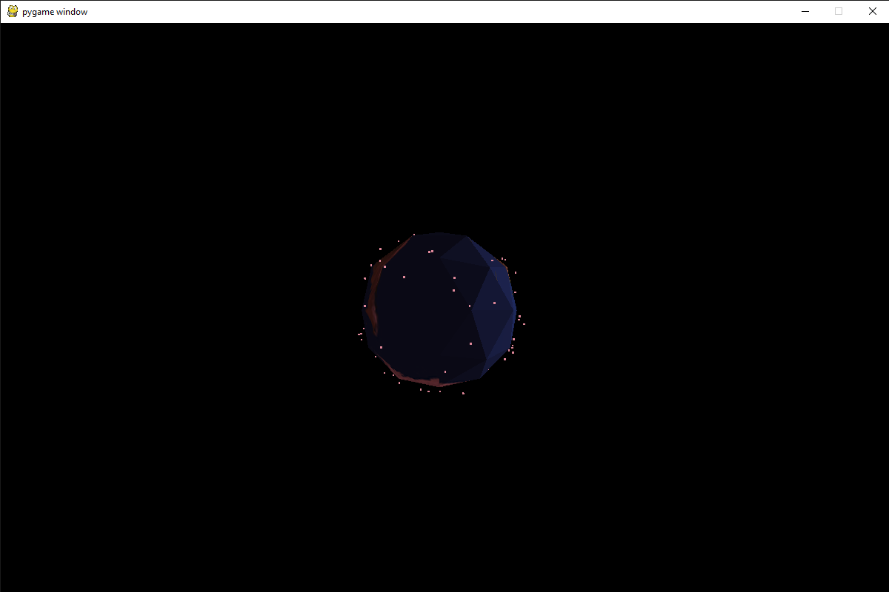

# Space Debris Simulation
NORAD satellite debris data simulation. Created for data testing and prototyping purposes.

COSMOS 2251 debris data set used in this simulation can be found at: https://www.celestrak.com/NORAD/elements/cosmos-2251-debris.txt
~ 100 data points used, all collected 10:00 AM PST, October 19, 2019.

